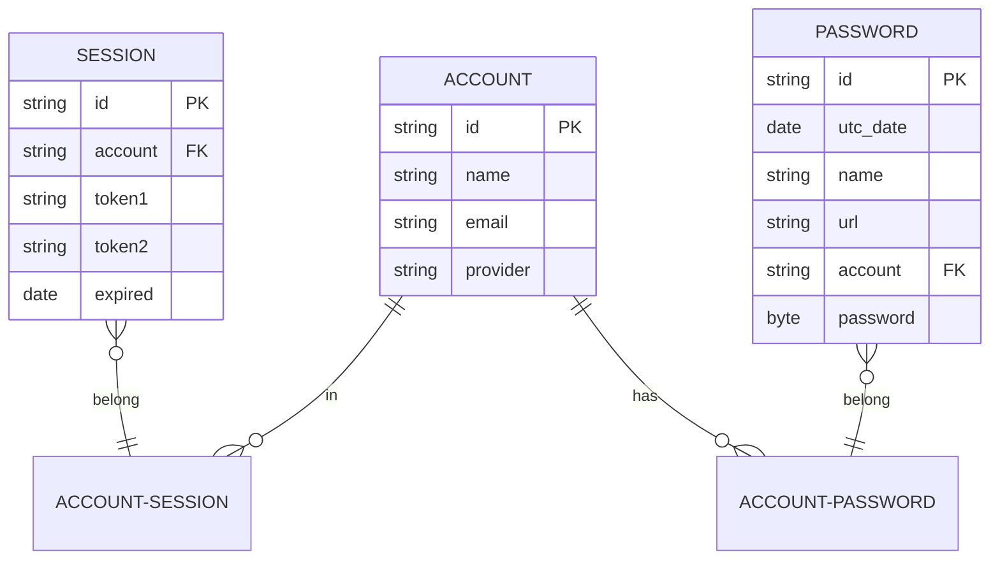

# Secrets #

This small program generates a random password. The user can specify password length, minimum quantity of Upercase letters, lowecase letters, digits and special characters. Some site won't accept all special character but some, the app accept an sample of special character to choose from.

## Motivation for creating this app ##

I was looking for a reason to learn about the [Secret library](https://docs.python.org/3/library/secrets.html) and I don't trusth password generator out there (call me old fashion ;-) )

## How to run this app ##

there are two ways to run it, both ways will use the default configuration, meaning 20 character
long and making sure at least one upper case character, one lower case characer, one digit and one
special character are being used.

1. pipenv:
    make sure you have python 3.10.0 and pipenv install on your machine and then:

    ```sh
    pipenv shell
    ./run.py
    ```

2. docker:

    ```sh
    docker build --rm -t secrets:latest .
    docker run --rm -t --name secrets-container secrets:latest
    ```

## How to run this app with custom parameters ##

```sh
# Using pipenv

./run.py -h # to get help
./run.py ./run.py -l 30 -p *+-:;<=>?

# Using docker
docker run --rm --name secrets-container -t -e LENGTH=30 -e MIN_PATTER=2 -e  SPECIAL_CHAR="*+-:;<=>?" secrets:latest
```

## Future plans ##

<!-- REFERENCE: https://mermaid-js.github.io/mermaid/#/ -->
The idea is to make a webapp hosted in AWS that allows multiple users. We would use OAuth2 with google/twitter/github
for authentication.

once the user is logged in it will see a search field. They will use this search field to find the credentials they are looking for. They can use either *name* or *url*. Then the app will show some imformation and other will be redacted,
however, they click on copy button (to copy the information to memory). No sensitive information (user/password) will be shown at any point.


